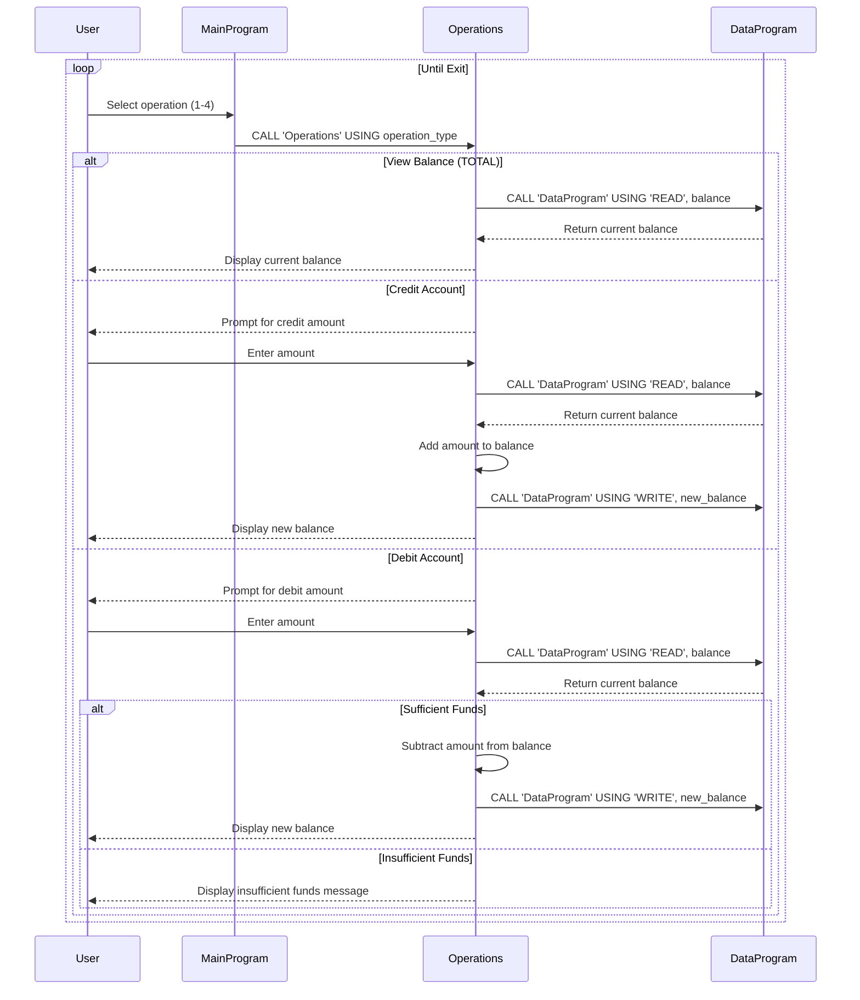

# Student Account Management System Documentation

This repository contains a legacy COBOL-based Student Account Management System. The system manages student account balances, allowing operations such as viewing balance, crediting funds, and debiting funds.

## Overview

The system consists of three COBOL programs that work together to provide a simple command-line interface for managing student accounts. The programs are modular, with separate responsibilities for data storage, user interface, and business logic.

## COBOL Files

### data.cob

**Purpose:** Data storage module responsible for maintaining the account balance in memory.

**Key Functions:**

- `READ` operation: Retrieves the current balance from storage
- `WRITE` operation: Updates the balance in storage

**Business Rules:**

- Initial account balance is set to $1000.00
- Balance is stored as a numeric value with 6 digits before decimal and 2 after (PIC 9(6)V99)

### main.cob

**Purpose:** Main entry point and user interface for the account management system.

**Key Functions:**

- Displays a menu-driven interface
- Accepts user input for operation selection
- Routes operations to the appropriate business logic module
- Handles program exit

**Business Rules:**

- Provides four menu options: View Balance, Credit Account, Debit Account, Exit
- Validates user input (accepts only 1-4)
- Continues operation until user chooses to exit

### operations.cob

**Purpose:** Business logic module that implements account operations and enforces business rules.

**Key Functions:**

- `TOTAL` operation: Displays current account balance
- `CREDIT` operation: Adds funds to the account
- `DEBIT` operation: Subtracts funds from the account (with validation)

**Business Rules:**

- **Credit Operations:** Allows adding any positive amount to the account balance
- **Debit Operations:** Only allows debiting if sufficient funds are available
- **Insufficient Funds Protection:** Prevents overdrafts by checking balance before debit
- **Balance Display:** Shows current balance after each operation

## System Architecture

The system follows a modular architecture:

- `main.cob` serves as the controller, handling user interaction
- `operations.cob` contains the business logic and rules
- `data.cob` manages persistent data storage

Programs communicate through CALL statements and linkage sections, passing operation types and balance values between modules.

## Usage

To run the system:

1. Compile all COBOL programs
2. Execute the main program (`main.cob`)
3. Follow the menu prompts to perform account operations

## Business Context

This system appears to be designed for managing student accounts, possibly for:

- Meal plan balances
- Student fee payments
- Campus account credits/debits

The $1000.00 initial balance and simple operations suggest it might be used for basic financial account management in an educational institution.

## Sequence Diagram

The following sequence diagram illustrates the data flow within the Student Account Management System:

